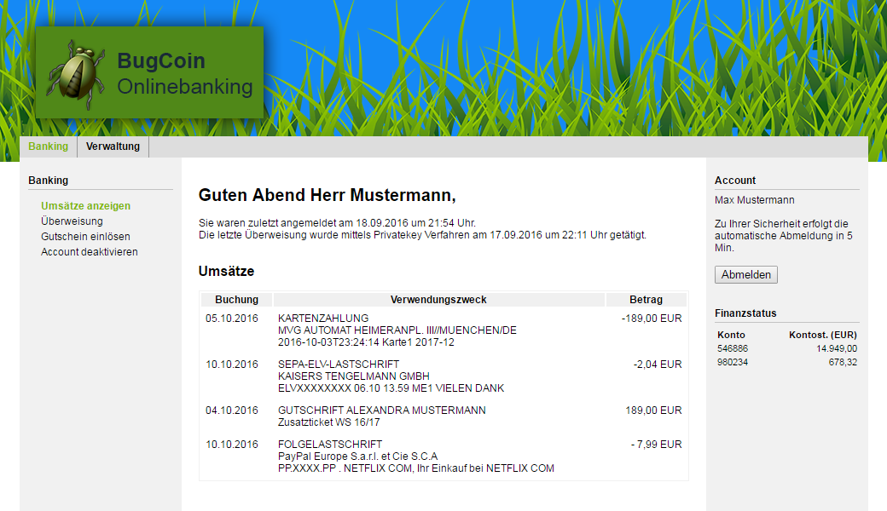

# Software-Sicherheit

Als Software die es sicher zu programmieren gilt, soll eine simple Onlinebanking Software namens "BugCoin" umgesetzt werden.

## Funktionen
### Benutzer
- Nutzerrollen: Benutzer, Premiumbenutzer, Administrator <html>&#10004;</html>
- Kontostand einsehen <html>&#10004;</html>
- Umsätze einsehen <html>&#10004;</html>
- Überweisungen tätigen <html>&#10004;</html>
- Registrierung durch Nutzer selbst <html>&#10004;</html>
- Geschenkkarte zum Konto aufladen <html>&#10004;</html>
- ~~Account deaktivieren~~

### Admin
- Account aktivieren/deaktivieren <html>&#10004;</html>
- Account upgrade/downgrade für Premiumbenutzer <html>&#10004;</html>
- Alle Accounts anzeigen <html>&#10004;</html>
- Geschenkkarten Codes erzeugen <html>&#10004;</html>

## Sicherheitsfeatures
- HTTPS, kein HTTP <html>&#10004;</html>
- Benutzername + Password zur Authentifizierung <html>&#10004;</html>
- Two Factor Authentication <html>&#10004;</html>
- ~~Captcha~~
- ~~Signieren von Überweisungen (TAN, Privatekey, ...)~~
- Logout nach Inaktivität <html>&#10004;</html>
- Freischaltung neuer Nutzer durch Admin, nach PostIdent Verfahren <html>&#10004;</html>
- Logging von Benutzer/Admin aktivitäten bezüglich SQL-Statements (heroku logging) <html>&#10004;</html>
- ~~Sperren nach mehrmaliger fehlerhafter Passwort Eingabe~~
- ~~Emailverifizierung~~

## Eingesetzte Technologien
- Java -> SpringBoot (Spring)
- Maven
- H2 database (development), PostgreSQL (deployment)
- Design patterns: MVC + Table Data Gateway

## Mockup
Eine Mockup Implementierung in HTML und CSS der Weboberfläche befindet sich im Ornder **html/**.

## Continuous integration   
https://travis-ci.com/shreaker/Secure_Software_Demo 

## Deployment
Unter https://bugcoin.herokuapp.com/ steht eine aktuelle Version der Webapplikation zur verfügung. 
Achtung: Bis dato wird die Applikation im development mode betrieben, das bedeutet die Datenbank wird spätestens nach 24h zurückgesetzt.
Push auf heroku branch notwendig um zu depolyen: Einmalig Heroku Command Line installieren und Branch hinzufügen heroku git:remote -a bugcoin.
Push: make im Project-Root-Verzeichnis ausführen. 
