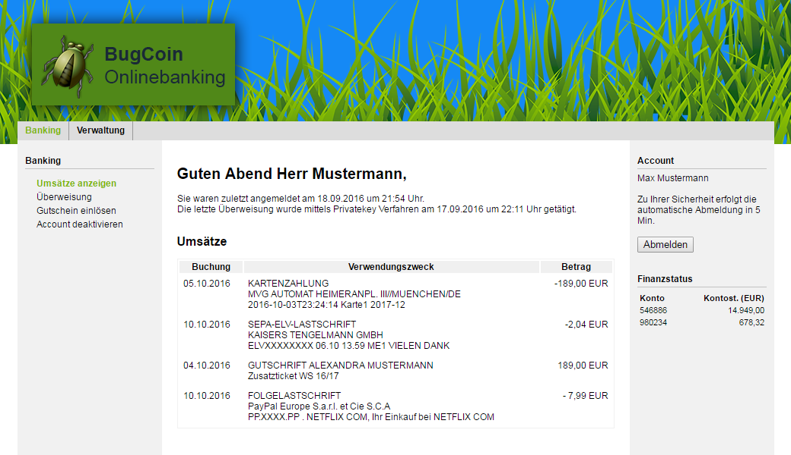

# Software-Sicherheit

Als Software die es sicher zu programmieren gilt, soll eine simple Onlinebanking Software namens "BugCoin" umgesetzt werden.

## Funktionen
- Nutzerrollen: Benutzer, Premiumbenutzer, Administrator
- Kontostand einsehen
- Umsätze einsehen
- Überweisungen tätigen
- Registrierung durch Nutzer selbst
- Account deaktivieren
- Geschenkkarte zum Konto aufladen

## Sicherheitsfeatures
- HTTPS, kein HTTP
- Benutzername + Password zur Authentifizierung
- Two Factor Authentication
- Captcha
- Signieren von Überweisungen (TAN, Privatekey, ...)
- Emailverifizierung
- Logout nach Inaktivität
- Freischaltung neuer Nutzer durch Admin, nach PostIdent Verfahren

## Eingesetzte Technologien
- Java / JavaEE
- Maven
- MySQL/MariaDB

## Mockup
